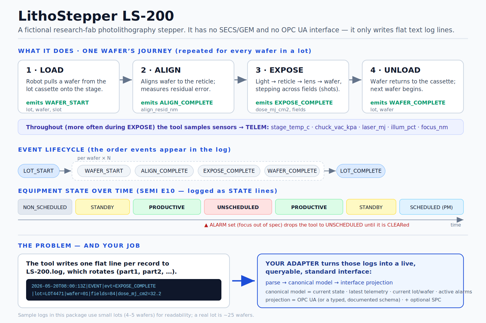

# Take-Home: Equipment Log → Standard Interface Adapter

**Role:** MES / Equipment Integration Engineer (intermediate)
**Window:** 4–5 days (for your scheduling flexibility). **Expected effort: ~8–10 focused hours.** The extra days are not an invitation to gold-plate — we explicitly value knowing *when to stop*. A clean, well-explained solution at the expected effort beats a sprawling one.
**Language:** Python is perfectly fine. A clean compiled-language implementation (Rust / C / C++) earns bonus consideration — but only if the architecture stays clean. Don't pick Rust to impress us and ship a tangle.

We care far more about **how you approach the problem** than how many features you finish.

Start with the figure below — it explains the equipment, what it emits, and exactly what your job is, on one page.



---

## Background

Many tools in our fab speak SECS/GEM or OPC UA natively. Some — older or research tools — do not. They just write **flat text log files**. Today nobody can see their state in our MES without a human reading logs.

Write a normal program (**not** an LLM, not an "AI agent") that reads one such tool's logs, reconstructs what it's doing, and exposes it through a **standard, queryable interface** an MES could connect to.

The tool is a fictional photolithography stepper, the **LithoStepper LS-200**. It writes one line per record to a log that **rotates** (`*_part1.log`, `*_part2.log`, …). See the figure for the wafer flow, the events it emits, and its states.

---

## What's in this repo

```
.
├── README.md                       # this file (the task)
├── docs/
│   ├── equipment_overview.svg      # READ FIRST — what the tool is and what you must build
│   └── equipment_overview.png
├── data/
│   ├── litho_eqp_part1.log         # CORE dataset, first rotation segment
│   ├── litho_eqp_part2.log         # CORE dataset, second rotation segment
│   ├── litho_eqp_drift_part1.log   # SPC-BONUS dataset (focus drift injected)
│   └── litho_eqp_drift_part2.log   # SPC-BONUS dataset
└── tools/
    └── generate_logs.py            # regenerates the logs (seeded; --drift for the SPC bonus)
```

Add your solution wherever you like (e.g. a `src/` directory) — restructure the repo as you see fit.

`python tools/generate_logs.py --seed <n>` makes different-but-valid variants (written into `data/`). **We grade against a different seed, so don't hard-code anything specific to these exact files.**

### Log format

Pipe-delimited. First two fields are always timestamp and type; the rest are **order-independent `key=value` pairs**:

```
<ISO8601_UTC>|<TYPE>|key=value|key=value|...
```

| TYPE  | Meaning |
|-------|---------|
| STATE | Equipment state transition (SEMI E10-style). Fields: `equipment_state`, `prev`. |
| EVENT | Lifecycle event. `evt` ∈ {LOT_START, WAFER_START, ALIGN_COMPLETE, EXPOSE_COMPLETE, WAFER_COMPLETE, LOT_COMPLETE}. |
| TELEM | Periodic sensor reading (more frequent during exposure). |
| ALARM | `state=SET` (with `sev`, `text`) or `state=CLEAR`. |

### Field glossary (so you don't have to guess the domain)

| Field | Meaning |
|-------|---------|
| `equipment_state` | STANDBY (idle), PRODUCTIVE (running a lot), UNSCHEDULED (down on a fault), SCHEDULED (planned maintenance), NON_SCHEDULED (off) |
| `lot` / `wafer` / `slot` | A *lot* is a batch of wafers; each *wafer* sits in a numbered *slot* |
| `recipe` / `reticle` | The exposure program, and the mask used |
| `dose_mj_cm2` | Exposure dose (mJ/cm²) |
| `align_resid_nm` | Residual alignment error after the align step (nm) |
| `fields` | Number of exposure fields ("shots") on the wafer |
| `stage_temp_c`, `chuck_vac_kpa`, `laser_mj`, `illum_pct`, `focus_nm` | Telemetry: stage temperature, chuck vacuum, laser pulse energy, illumination intensity, focus offset |

---

## The task

Build an adapter with **three decoupled layers**:

1. **Ingest / parse** — read the log segment(s) in order, tolerantly; turn each line into a structured record.
2. **Canonical model** — maintain an *equipment-agnostic*, live model: current state, latest telemetry, current lot/wafer in progress, and the set of currently-active alarms. **This is the heart of the task.** Logs are a stream of *events*; a standard interface is *stateful*. You bridge that gap here. This layer must not know what protocol it's served over.
3. **Interface projection** — expose the canonical model over a standard interface (see below).

### The interface

**Preferred: OPC UA.** Design a small but sensibly-structured address space (e.g. an Equipment object with State, Telemetry, CurrentLot, and Alarms beneath it) — not a flat dump of raw log keys. A standard client (UaExpert, or an `asyncua` client script) should browse and read it. OPC UA earns **bonus** credit (it's the real-world target for this role).

**Also fully acceptable for core credit: a WebSocket or HTTP/JSON interface — *only* if it presents a properly typed, hierarchical, documented schema** (i.e. an information model: named types, units, structure). A flat `json.dumps(dict)` of raw keys is **not** acceptable and scores poorly on modeling. A WebSocket push interface is, if anything, a nice fit — it mirrors the subscribe-to-changes model OPC UA itself uses.

The point is the *modeling and the decoupling*, not which library you picked. Pick one interface; do it well.

### Scope

**MUST**
- Parse both core segments correctly, in order, as **one continuous stream** (a lot spans the rotation boundary).
- Maintain the canonical model: current E10 state, latest telemetry, current lot/wafer, active alarms.
- Expose it over your chosen interface so a client can read the live values.
- Handle malformed input without crashing. **Decide and state your policy** (skip + count? warn? quarantine?). Silently producing wrong numbers is the wrong answer.

**SHOULD (pick based on your time)**
- A short README: your design (the three layers + how a second interface would slot in), assumptions, malformed-input policy, and what you'd do with more time. **This matters a lot** — we read it first.
- A few tests, especially around parsing and state reconstruction.
- Make adding a new log line type a small, localized change.

**STRETCH / BONUS (only if the core is solid — do NOT sacrifice structure for these)**
- **SPC monitor** — see the dedicated section below.
- Implement the **OPC UA** projection (if you chose it, that's your interface; doing it well is the bonus).
- Design (in writing) how the *same* canonical model maps to **SECS/GEM** (equipment state model, collection events, status variables, alarms). Implementing it via `secsgem` is a further plus.
- Live **tailing** / rotation handling, or **config-driven** parsing (a new tool = a config file, not new code).

> The single most informative thing you can do: structure the code so a **second interface is cheap to add**. If we asked you to also emit SECS/GEM, would it be a small new module, or a rewrite? You don't have to implement it — just build so you *could*.

---

## Bonus: a small SPC monitor

In a real fab, the normalized telemetry you just produced is exactly what feeds **SPC / fault detection**. This bonus asks you to wire a tiny statistical monitor onto your telemetry stream.

Use the **drift dataset** (`data/litho_eqp_drift_*.log`): the focus offset drifts slowly upward across `LOT4472`, the way a real tool degrades.

**What to build**
- An **online EWMA control chart** over a quality-critical parameter (`focus_nm` is the intended target; `dose_mj_cm2` or `align_resid_nm` are also valid). Suggested λ ≈ 0.2, control limits at L ≈ 3σ, with target and σ estimated from the in-control period. Flag a point when the EWMA statistic crosses a control limit. A couple of Western-Electric / Nelson run rules are a nice touch.
- It must be **online/streaming** — update incrementally per sample, don't recompute over the whole history each tick — and it should plug in as **another consumer of the canonical model**, not a second parser.
- **Optional:** a simple **time-to-spec-violation** estimate (linear trend over a window → when does it cross the spec limit). 

> **Do not** reach for ARIMA/LSTM/heavy ML. Simple, justified statistics only — that's the point, and it's what we'd grade.

**Documented ground truth** (so you can check yourself; we grade against a possibly different seed):
- Spec: `|focus_nm| > 15 nm` is out of spec. In-control: target ≈ 0, σ ≈ 2.5 nm.
- With λ=0.2, L=3, a correct EWMA chart flags the drift at roughly **08:01:44** (~the 25th focus sample), when the EWMA statistic crosses its limit **while the raw reading is still only ~11 nm (in spec)**.
- The first *single* raw reading to exceed spec doesn't occur until **08:02:06** (focus = 19 nm) — about **14 samples / ~20 s later**.
- That gap is the whole point: EWMA catches the small persistent shift well before any single point breaches. The exact sample depends on your σ/target/warmup choices — we grade **detection well before the raw breach, with no flood of false alarms**, and your method, not the exact index.

---

## What to submit

- Source in a repo or zip.
- README (run instructions + design + malformed-input policy + assumptions + next steps).
- Tests if you wrote them.
- For grading we should be able to start your interface pointed at the two log files and inspect the live state with a standard client (OPC UA) or your documented client (WebSocket/HTTP).

---

## Grading rubric

**Core (100 pts)**

| Area | Pts | What we look for |
|------|-----|------------------|
| Modularity / architecture | 30 | Three genuinely decoupled layers. Canonical model is protocol-agnostic. A second interface would be additive, not a rewrite. No single 500-line function. |
| Modeling quality | 25 | Sensible canonical model (state + telemetry + lot/wafer + alarms). A **structured** interface (meaningful hierarchy/types), not a flat key dump. State correctly reconstructed — incl. the lot spanning rotation and active-alarm tracking across the SET/CLEAR gap. |
| Robustness | 15 | Survives the torn line, the stray banner line, reordered/missing keys without crashing or silently corrupting state. Explicit, sensible error policy. |
| Correctness | 15 | At end of stream, the live state / telemetry / active alarms / current lot are right. |
| Communication | 10 | README explains the *why*. Clear assumptions and tradeoffs. We're hiring someone we can reason with. |
| Code quality / tests | 5 | Readable, well-named, a few meaningful tests. |

**Bonus (additive, capped at +20; never rescues a weak core)**

| Item | Pts |
|------|-----|
| OPC UA projection with a proper address space | +3 |
| Clean compiled-language (Rust / C / C++) impl, architecture intact | +6 |
| SPC: online EWMA monitor that catches the drift | +6 |
| SPC: + sensible time-to-spec-violation forecast | +2 |
| SECS/GEM mapping in writing (+2 more for a working impl) | +2 |
| Live tailing/rotation **or** config-driven parsing | +2 |

We are explicitly **not** scoring: a complete SECS/GEM implementation, OPC UA security/certificates, fancy UI, or raw throughput.

---

## Background reading

You're not expected to know SECS/GEM or SPC going in. Skim enough to model sensibly. (The formal SEMI standards — E5, E30, E37, E10, E183 — are paywalled, so use these open explainers.)

**OPC UA (preferred interface)**
- OPC Foundation — What is OPC UA: https://opcfoundation.org/about/opc-technologies/opc-ua/
- `asyncua` (Python client/server): https://github.com/FreeOpcUa/opcua-asyncio (server examples in `examples/`)
- Rust OPC UA: https://github.com/FreeOpcUa/rust-opcua  · C: https://www.open62541.org/
- UaExpert (free GUI client to test your server): https://www.unified-automation.com/products/development-tools/uaexpert.html

**SECS/GEM (only for the stretch mapping)**
- `secsgem` (Python, both equipment & host): https://github.com/bparzella/secsgem · docs https://secsgem.readthedocs.io/
- GEM concepts (states, collection events, status variables, alarms): https://secsgem.readthedocs.io/en/latest/firststeps.html
- Hands-on walkthrough: http://soup01.com/en/2024/08/20/plcnextlet-use-python-with-the-secs-gem-library-and-test-with-ignition/

**SPC (only for the SPC bonus)**
- NIST/SEMATECH e-Handbook of Statistical Methods: https://www.itl.nist.gov/div898/handbook/ — see *Process or Product Monitoring and Control* → **EWMA Control Charts** (and CUSUM).
- Search terms worth knowing: "EWMA control chart", "Western Electric rules" / "Nelson rules", "CUSUM".

**Concept**
- SEMI E10 equipment states give the vocabulary for `equipment_state` (productive / standby / engineering / scheduled & unscheduled downtime / non-scheduled). Any short "E10 equipment states" summary suffices.

Good luck — lean toward explaining your reasoning. We read the README first.
# mes-engineer-interview-task
